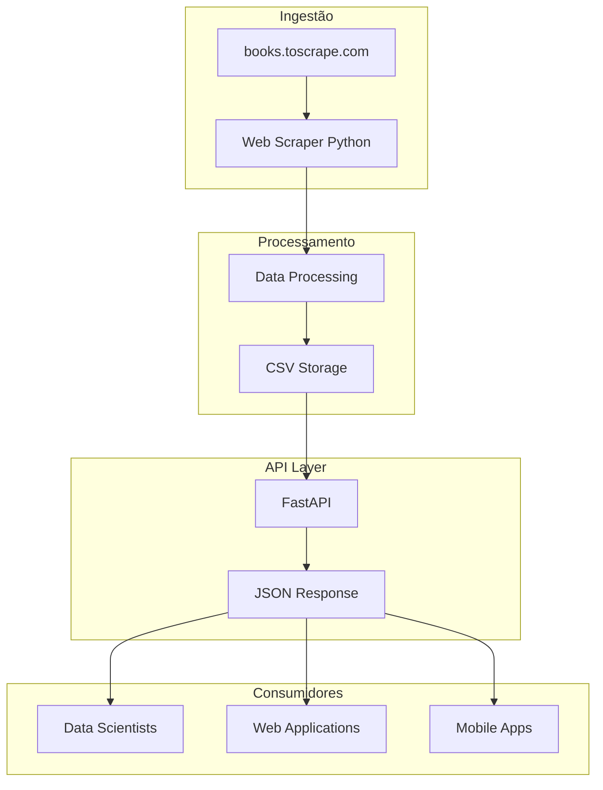
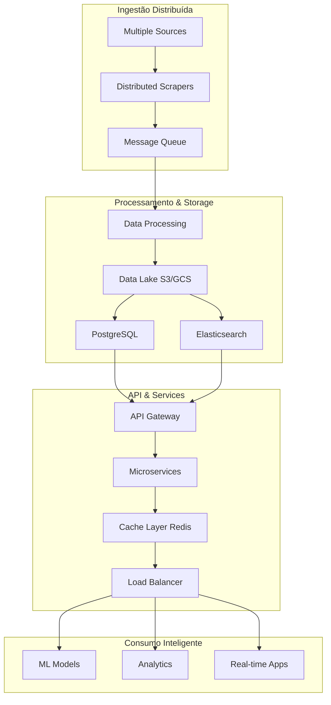
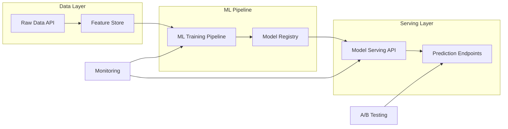
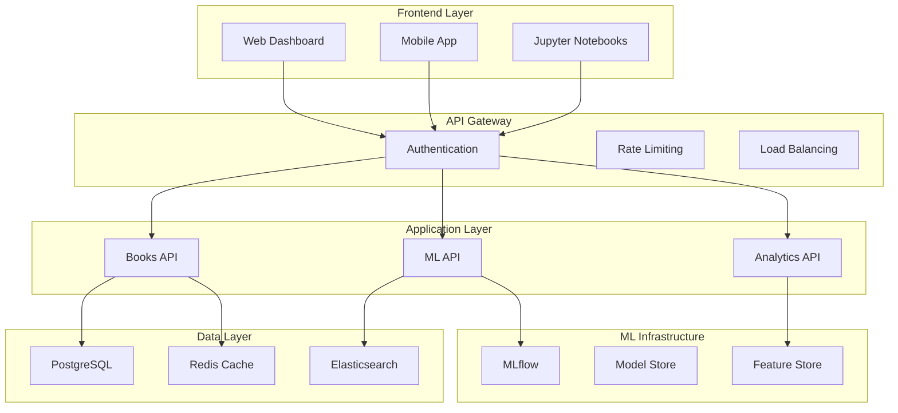

# Diagrama do Pipeline de Dados

## Pipeline Atual (MVP)

```mermaid
graph TD
    A[books.toscrape.com] --> B[Web Scraper Python]
    B --> C[Data Processing]
    C --> D[CSV Storage]
    D --> E[FastAPI]
    E --> F[JSON Response]
    F --> G[Data Scientists]
    F --> H[Web Applications]
    F --> I[Mobile Apps]
    
    subgraph "Ingestão"
        A
        B
    end
    
    subgraph "Processamento"
        C
        D
    end
    
    subgraph "API Layer"
        E
        F
    end
    
    subgraph "Consumidores"
        G
        H
        I
    end
```

## Pipeline Escalável (Futuro)

```mermaid
graph TD
    A[Multiple Sources] --> B[Distributed Scrapers]
    B --> C[Message Queue]
    C --> D[Data Processing]
    D --> E[Data Lake S3/GCS]
    E --> F[PostgreSQL]
    E --> G[Elasticsearch]
    F --> H[API Gateway]
    G --> H
    H --> I[Microservices]
    I --> J[Cache Layer Redis]
    J --> K[Load Balancer]
    K --> L[ML Models]
    K --> M[Analytics]
    K --> N[Real-time Apps]
    
    subgraph "Ingestão Distribuída"
        A
        B
        C
    end
    
    subgraph "Processamento & Storage"
        D
        E
        F
        G
    end
    
    subgraph "API & Services"
        H
        I
        J
        K
    end
    
    subgraph "Consumo Inteligente"
        L
        M
        N
    end
```

## Fluxo de ML Integration

```mermaid
graph LR
    A[Raw Data API] --> B[Feature Store]
    B --> C[ML Training Pipeline]
    C --> D[Model Registry]
    D --> E[Model Serving API]
    E --> F[Prediction Endpoints]
    
    subgraph "Data Layer"
        A
        B
    end
    
    subgraph "ML Pipeline"
        C
        D
    end
    
    subgraph "Serving Layer"
        E
        F
    end
    
    G[Monitoring] --> C
    G --> E
    H[A/B Testing] --> F
```

## Arquitetura de Componentes

```mermaid
graph TB
    subgraph "Frontend Layer"
        A[Web Dashboard]
        B[Mobile App]
        C[Jupyter Notebooks]
    end
    
    subgraph "API Gateway"
        D[Authentication]
        E[Rate Limiting]
        F[Load Balancing]
    end
    
    subgraph "Application Layer"
        G[Books API]
        H[ML API]
        I[Analytics API]
    end
    
    subgraph "Data Layer"
        J[PostgreSQL]
        K[Redis Cache]
        L[Elasticsearch]
    end
    
    subgraph "ML Infrastructure"
        M[MLflow]
        N[Model Store]
        O[Feature Store]
    end
    
    A --> D
    B --> D
    C --> D
    D --> G
    D --> H
    D --> I
    G --> J
    G --> K
    H --> L
    H --> M
    I --> O
```
